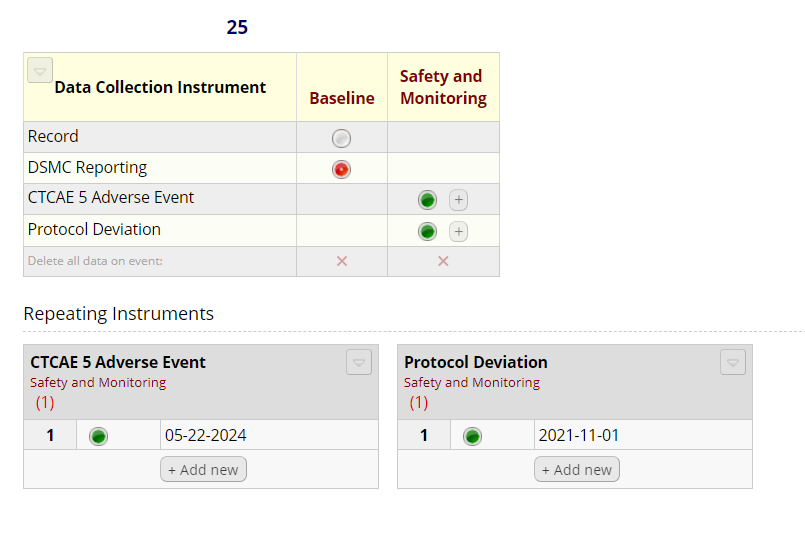

<!-- README.md is generated from README.Rmd. Please edit that file -->

# DSMC

Data and safety monitor (DSM) reporting is a necessary, but
time-intensive process for clinical trials. We built a tool that
integrates flexible REDCap instruments, that naturally fit into the data
entry workflow, with an RStudio project. The tool automatically produces
data and safety monitor reports, customizable by clinical trial, with
features like consort diagrams, enrollment data, and safety analyses,
saving time and facilitating better trial quality monitoring.

This project was developed from work on the [COMET
Study](https://journals.plos.org/plosone/article?id=10.1371/journal.pone.0293874)
(RO1 AG070036) The work is being converted into a package for improved
usability and accessibility.

## DISCLAIMER

The consort diagrams in this project only support two group
interventions. Only the CTCAE 5.0 classification is supported for
adverse event reporting. You will need an API token to your REDCap
project.

This project has not been thoroughly tested and might not work easily
for your needs. It will require small updates to code and it might
require extensive work. Please feel free to use it, as you see fit, to
improve the efficiency of your study; however, if you’d like a fully
tested and more easily implemented package, please follow along at
<https://github.com/jclutton/dsmreport>. We hope to have the package
available by fall 2024.

## Instructions for use

1.  Download a ZIP file of the code and instruments from
    <https://github.com/jclutton/DSMC>.

    1.  To do this, press the green Code button and select Download Zip

2.  Extract the contents of the ZIP to where you plan to use the
    project. If your project might contain identifying information, be
    sure to use a secure drive.

3.  Find the redcap_instruments folder in the DSMC folder

    1.  Install the three instruments in your REDCap project. Do not
        change the names of any variables. You can change the labels to
        some field choices, as explained within each instrument.

    2.  Be sure you have all of the instruments in a single project.
        This iteration of code does not support a screening database
        separate from a main database.

    3.  DSMC Reporting Instrument

        - This instrument contains most of the fields for the DSM
          report, i.e. demographics and key time points. If you have a
          longitudinal project, it should only be installed at one time
          point. You may move fields to be in other instruments so long
          as you don’t change the variable name.

    4.  CTCAE 5 Adverse Event

    - This instrument is built to collect adverse event data. It was
      built to work within teams where study coordinators collect data
      and investigators classify adverse events.

    - Please set this instrument up at a single time point in your
      project as a repeating instrument.

    - If used within a team, we recommend setting up alerts to trigger
      investigator signatures.

    5.  Protocol Deviation

        - This instrument collects protocol deviation and violations.

        - Please set this instrument up in the same time point as the
          CTCAE 5 Adverse Event Instrument as a repeating instrument

    6.  Example REDCap Setup

    

4.  Get the API and and REDCap uri for your project. This will be a
    different process for every institution, so please follow your
    institution’s guidelines.

5.  Download [R](https://www.r-project.org/) and
    [RStudio](https://posit.co/download/rstudio-desktop/)

6.  Open the DSMC.Rproj file in the DSMC folder. This will open a
    workspace.

7.  Open the master_script.R file

    1.  Select File -\> Open File -\> R -\> master_script.R

8.  Edit the necessary information at the top of the script

    - redcap_uri

    - token

    - date_of_last_report

    - root (root of file path)

    - drive_dir (parent folder to where DSMC is saved)

9.  Source the master_script.R and fix any issues

